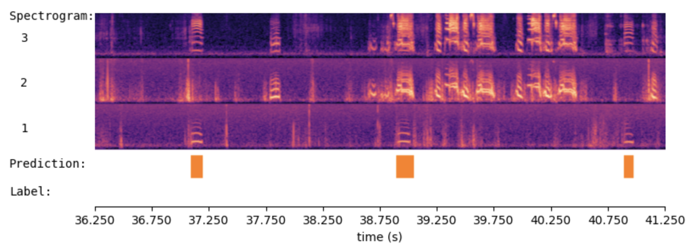

# WhisperSeg: Positive Transfer Of The Whisper Speech Transformer To Human And Animal Voice Activity Detection


## Install Environment

```bash
conda create -n wseg python=3.10 -y
conda activate wseg
pip install -r requirements.txt
conda install conda-forge::cudnn==8.9.7.29 -y
```

**NOTE for Windows OS:** For method 1 and 2, if running WhisperSeg on windows, one need to further uninstall 'bitsandbytes' by 
```bash
pip uninstall bitsandbytes
```
and then install 'bitsandbytes-windows==0.37.5'
```bash
pip install bitsandbytes-windows==0.37.5
```

Then open a new terminal, you can activate the 'wseg' environment by 
```bash
conda activate wseg
```

## Preprocess dataset
The training data folder is organized as below:
```
├── audio_count_0_channel_1.json
├── audio_count_0_channel_1.wav
├── audio_count_0_channel_2.wav
├── audio_count_0_channel_3.wav
├── audio_count_1_channel_1.json
├── audio_count_1_channel_1.wav
├── audio_count_1_channel_2.wav
├── audio_count_1_channel_3.wav
├── audio_count_2_channel_1.json
├── audio_count_2_channel_1.wav
├── audio_count_2_channel_2.wav
├── audio_count_2_channel_3.wav
├── audio_count_3_channel_1.json
├── audio_count_3_channel_1.wav
├── audio_count_3_channel_2.wav
└── audio_count_3_channel_3.wav
```
Three channels of audios are organized as:

AUDIO_FNAME_**channel_1**.wav <br>
AUDIO_FNAME_**channel_2**.wav <br>
AUDIO_FNAME_**channel_3**.wav <br>

The corresponding annotation JSON file is named as:

AUDIO_FNAME_**channel_1**.json 

## Training 

```bash
python train.py --initial_model_path nccratliri/whisperseg-animal-vad --model_folder model/mc-whisperseg-example --train_dataset_folder data/example_subset/zebra_finch_train_and_test/train/ --mask_rate 0 --max_num_iterations 500
```

* --mask_rate: randomly silence part of the certain channel with the probability of mask_rate. Suitable for the case where in the training dataset some channels miss occasionally. Default value is 0


## Inference

```python
from model import WhisperSegmenter, WhisperSegmenterFast
from audio_utils import SpecViewer
import librosa
import numpy as np
import json
```


```python
spec_viewer = SpecViewer()
segmenter = WhisperSegmenterFast(  model_path = "model/mc-whisperseg-example/final_checkpoint_ct2/", 
                                   device="cuda", device_ids = [0] )
```

    Special tokens have been added in the vocabulary, make sure the associated word embeddings are fine-tuned or trained.


```python
channel_audio_fnames = [ 
    "data/example_subset/zebra_finch_train_and_test/test/audio_count_2_channel_1.wav",
    "data/example_subset/zebra_finch_train_and_test/test/audio_count_2_channel_2.wav",
    "data/example_subset/zebra_finch_train_and_test/test/audio_count_2_channel_3.wav"
]

sr = 16000
audio_channels = [ librosa.load( fname, sr = sr )[0] for fname in channel_audio_fnames ]
audio = np.asarray( audio_channels )
print(audio.shape)
```

    (3, 800000)


```python
prediction = segmenter.segment(  audio, sr = sr)
spec_viewer.visualize( audio, sr, 
                       audio_channel_names=["1","2","3"], 
                       prediction = prediction
                     )
```




