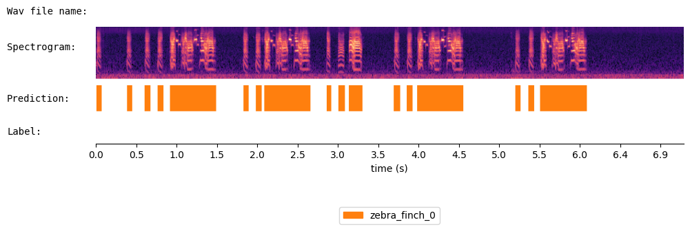
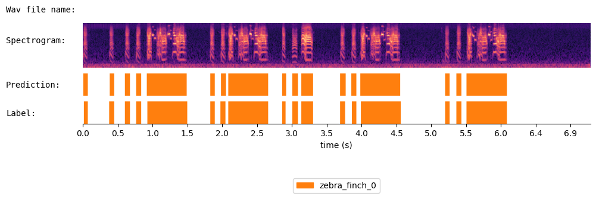
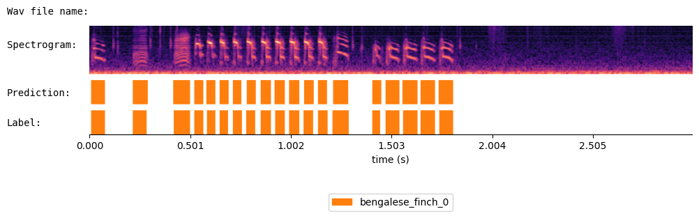
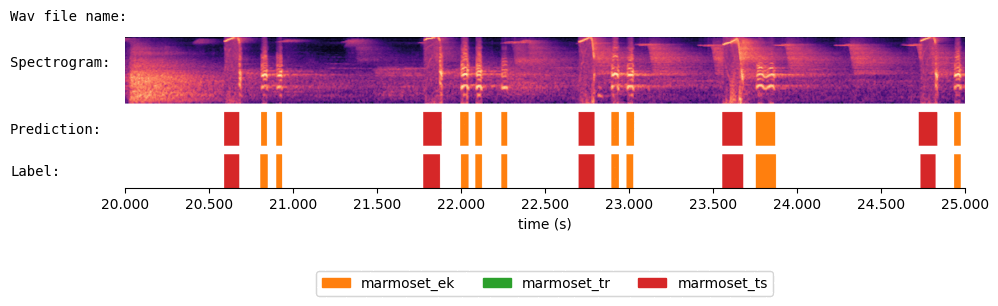

# Positive Transfer Of The Whisper Speech Transformer To Human And Animal Voice Activity Detection
We proposed **WhisperSeg**, utilizing the Whisper Transformer pre-trained for Automatic Speech Recognition (ASR) for both human and animal Voice Activity Detection (VAD). For more details, please refer to our paper:
> [**Positive Transfer of the Whisper Speech Transformer to Human and Animal Voice Activity Detection**](https://doi.org/10.1101/2023.09.30.560270)
> 
> Nianlong Gu, Kanghwi Lee, Maris Basha, Sumit Kumar Ram, Guanghao You, Richard H. R. Hahnloser <br>
> University of Zurich and ETH Zurich

## Install Environment
```bash
conda create -n wseg python=3.10 -y
conda activate wseg
pip install -r requirements.txt
conda install -c pypi cudnn -y
```

## Documentation
Please refer to the following documents for the complete pipeline of training WhisperSeg, including 1) dataset processing, 2) model training and 3) model evaluation.

1. [Dataset Processing](docs/DatasetProcessing.md)
2. [Model Training](docs/ModelTraining.md)
3. [Evaluation](docs/Evaluation.md)
4. [Run WhisperSeg as a Web Service](docs/RunWhisperSegAsWebService.md)  
   This allows running WhisperSeg on a Web server, and call the segmentation service from any client of different environments, such as python or MatLab. The best way to incorporate WhisperSeg into your original workflow.

We have also prepared a Jupyter notebook that provides a comprehensive walkthrough of WhisperSeg finetuning. This includes steps for data processing, training, and evaluation. You can access this notebook at [docs/WhisperSeg_Training_Pipeline.ipynb](docs/WhisperSeg_Training_Pipeline.ipynb), or run it in Google Colab: <a href="https://colab.research.google.com/github/nianlonggu/WhisperSeg/blob/master/docs/WhisperSeg_Training_Pipeline.ipynb" target="_parent"></a>

## Voice Activity Detection Demo <a href="https://colab.research.google.com/github/nianlonggu/WhisperSeg/blob/master/docs/WhisperSeg_Voice_Activity_Detection_Demo.ipynb" target="_parent"></a>
We demonstrate here using a WhisperSeg trained on multi-species data to segment the audio files of different species.

### Load the pretrained multi-species WhisperSeg

#### Huggingface model


```python
from model import WhisperSegmenter
segmenter = WhisperSegmenter( "nccratliri/whisperseg-large-ms", device="cuda" )
```
#### CTranslate2 version for faster inference

Alternatively, we provided a [CTranslate2](https://github.com/OpenNMT/CTranslate2) converted version, which enables 4x faster inference speed. To use this converted model, we need to import the "WhisperSegmenterFast" module.


```python
from model import WhisperSegmenterFast
segmenter = WhisperSegmenterFast( "nccratliri/whisperseg-large-ms-ct2", device="cuda" )
```

### Illustration of segmentation parameters

The following paratemers need to be configured for different species.
* **sr**: sampling rate $f_s$ of the audio when loading
* **min_frequency**: the minimum frequency when computing the Log Melspectrogram. Frequency components below min_frequency will not be included in the input spectrogram
* **spec_time_step**: Spectrogram Time Resolution. By default, one single input spectrogram of WhisperSeg contains 1000 columns. 'spec_time_step' represents the time difference between two adjacent columns in the spectrogram. It is equal to FFT_hop_size / sampling_rate: $\frac{L_\text{hop}}{f_s}$ .
* **min_segment_length**: The minimum allowed length of predicted segments. The predicted segments whose length is below 'min_segment_length' will be discarded.
* **eps**: The threshold $\epsilon_\text{vote}$ during the multi-trial majority voting when processing long audio files
* **num_trials**: The number of segmentation variant produced during the multi-trial majority voting process. Setting num_trials to 1 for noisy data with long segment durations, such as the human AVA-speech dataset, and set num_trials to 3 when segmenting animal vocalizations.

The recommended settings of these parameters are listed in Table 1 in the paper:


### Segmentation Examples


```python
import librosa
import json
from audio_utils import SpecViewer
### SpecViewer is a customized class for interactive spectrogram viewing
spec_viewer = SpecViewer()
```

#### Zebra finch (adults)


```python
sr = 32000  
min_frequency = 0
spec_time_step = 0.0025
min_segment_length = 0.01
eps = 0.02
num_trials = 3
```


```python
audio, _ = librosa.load( "data/example_subset/Zebra_finch/test_adults/zebra_finch_g17y2U-f00007.wav", 
                         sr = sr )
```


```python
prediction = segmenter.segment(  audio, sr = sr, min_frequency = min_frequency, spec_time_step = spec_time_step,
                       min_segment_length = min_segment_length, eps = eps,num_trials = num_trials )
print(prediction)
```

  {'onset': [0.01, 0.38, 0.603, 0.758, 0.912, 1.813, 1.967, 2.073, 2.838, 2.982, 3.112, 3.668, 3.828, 3.953, 5.158, 5.323, 5.467], 'offset': [0.073, 0.447, 0.673, 0.83, 1.483, 1.882, 2.037, 2.643, 2.893, 3.063, 3.283, 3.742, 3.898, 4.523, 5.223, 5.393, 6.043], 'cluster': ['zebra_finch_0', 'zebra_finch_0', 'zebra_finch_0', 'zebra_finch_0', 'zebra_finch_0', 'zebra_finch_0', 'zebra_finch_0', 'zebra_finch_0', 'zebra_finch_0', 'zebra_finch_0', 'zebra_finch_0', 'zebra_finch_0', 'zebra_finch_0', 'zebra_finch_0', 'zebra_finch_0', 'zebra_finch_0', 'zebra_finch_0']}


```python
spec_viewer.visualize( audio = audio, sr = sr, min_frequency= min_frequency, prediction = prediction,
                       window_size=8, precision_bits=1 
                     )
```



Let's load the human annoated segments and compare them with WhisperSeg's prediction.


```python
label = json.load( open("data/example_subset/Zebra_finch/test_adults/zebra_finch_g17y2U-f00007.json") )
spec_viewer.visualize( audio = audio, sr = sr, min_frequency= min_frequency, prediction = prediction, label=label,
                       window_size=8, precision_bits=1 
                     )
```



#### Zebra finch (juveniles)


```python
sr = 32000  
min_frequency = 0
spec_time_step = 0.0025
min_segment_length = 0.01
eps = 0.02
num_trials = 3

audio_file = "data/example_subset/Zebra_finch/test_juveniles/zebra_finch_R3428_40932.29996086_1_24_8_19_56.wav"
label_file = audio_file[:-4] + ".json"
audio, _ = librosa.load( audio_file, sr = sr )
label = json.load( open(label_file) )

prediction = segmenter.segment(  audio, sr = sr, min_frequency = min_frequency, spec_time_step = spec_time_step,
                       min_segment_length = min_segment_length, eps = eps,num_trials = num_trials )
spec_viewer.visualize( audio = audio, sr = sr, min_frequency= min_frequency, prediction = prediction, label=label, 
                       window_size=15, precision_bits=1 )
```


#### Bengalese finch


```python
sr = 32000  
min_frequency = 0
spec_time_step = 0.0025
min_segment_length = 0.01
eps = 0.02
num_trials = 3

audio_file = "data/example_subset/Bengalese_finch/test/bengalese_finch_bl26lb16_190412_0721.20144_0.wav"
label_file = audio_file[:-4] + ".json"
audio, _ = librosa.load( audio_file, sr = sr )
label = json.load( open(label_file) )

prediction = segmenter.segment(  audio, sr = sr, min_frequency = min_frequency, spec_time_step = spec_time_step,
                       min_segment_length = min_segment_length, eps = eps,num_trials = num_trials )
spec_viewer.visualize( audio = audio, sr = sr, min_frequency= min_frequency, prediction = prediction, label=label, 
                       window_size=3 )
```



#### Marmoset


```python
sr = 48000  
min_frequency = 0
spec_time_step = 0.0025
min_segment_length = 0.01
eps = 0.02
num_trials = 3

audio_file = "data/example_subset/Marmoset/test/marmoset_pair4_animal1_together_A_0.wav"
label_file = audio_file[:-4] + ".json"
audio, _ = librosa.load( audio_file, sr = sr )
label = json.load( open(label_file) )

prediction = segmenter.segment(  audio, sr = sr, min_frequency = min_frequency, spec_time_step = spec_time_step,
                       min_segment_length = min_segment_length, eps = eps,num_trials = num_trials )
spec_viewer.visualize( audio = audio, sr = sr, min_frequency= min_frequency, prediction = prediction, label=label )
```



#### Mouse


```python
sr = 300000  
min_frequency = 35000
spec_time_step = 0.0005
min_segment_length = 0.01
eps = 0.02
num_trials = 3

audio_file = "data/example_subset/Mouse/test/mouse_Rfem_Afem01_0.wav"
label_file = audio_file[:-4] + ".json"
audio, _ = librosa.load( audio_file, sr = sr )
label = json.load( open(label_file) )

prediction = segmenter.segment(  audio, sr = sr, min_frequency = min_frequency, spec_time_step = spec_time_step,
                       min_segment_length = min_segment_length, eps = eps,num_trials = num_trials )
spec_viewer.visualize( audio = audio, sr = sr, min_frequency= min_frequency, prediction = prediction, label=label )
```


#### Human (AVA-Speech)


```python
sr = 16000  
min_frequency = 0
spec_time_step = 0.01
min_segment_length = 0.1
eps = 0.2
num_trials = 1

audio_file = "data/example_subset/Human_AVA_Speech/test/human_xO4ABy2iOQA_clip.wav"
label_file = audio_file[:-4] + ".json"
audio, _ = librosa.load( audio_file, sr = sr )
label = json.load( open(label_file) )

prediction = segmenter.segment(  audio, sr = sr, min_frequency = min_frequency, spec_time_step = spec_time_step,
                       min_segment_length = min_segment_length, eps = eps,num_trials = num_trials )
spec_viewer.visualize( audio = audio, sr = sr, min_frequency= min_frequency, prediction = prediction, label=label, 
                       window_size=20, precision_bits=0, xticks_step_size = 2 )
```


## Citation
When using our code or models for your work, please cite the following paper:
```
@article {Gu2023.09.30.560270,
	author = {Nianlong Gu and Kanghwi Lee and Maris Basha and Sumit Kumar Ram and Guanghao You and Richard Hahnloser},
	title = {Positive Transfer of the Whisper Speech Transformer to Human and Animal Voice Activity Detection},
	elocation-id = {2023.09.30.560270},
	year = {2023},
	doi = {10.1101/2023.09.30.560270},
	publisher = {Cold Spring Harbor Laboratory},
	abstract = {This paper introduces WhisperSeg, utilizing the Whisper Transformer pre-trained for Automatic Speech Recognition (ASR) for human and animal Voice Activity Detection (VAD). Contrary to traditional methods that detect human voice or animal vocalizations from a short audio frame and rely on careful threshold selection, WhisperSeg processes entire spectrograms of long audio and generates plain text representations of onset, offset, and type of voice activity. Processing a longer audio context with a larger network greatly improves detection accuracy from few labeled examples. We further demonstrate a positive transfer of detection performance to new animal species, making our approach viable in the data-scarce multi-species setting.Competing Interest StatementThe authors have declared no competing interest.},
	URL = {https://www.biorxiv.org/content/early/2023/10/02/2023.09.30.560270},
	eprint = {https://www.biorxiv.org/content/early/2023/10/02/2023.09.30.560270.full.pdf},
	journal = {bioRxiv}
}
```

## Contact
Nianlong Gu
nianlong.gu@uzh.ch


