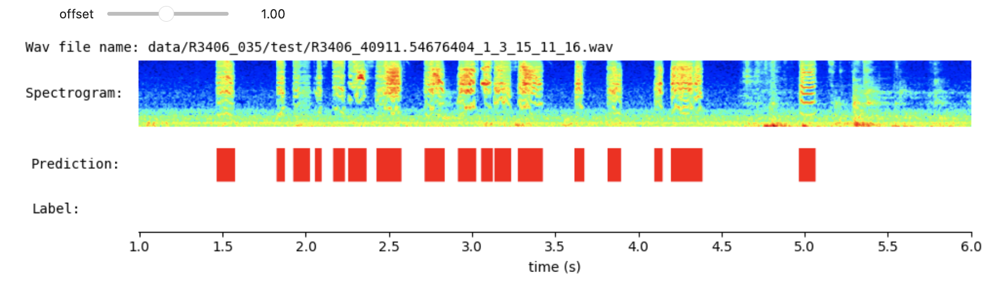
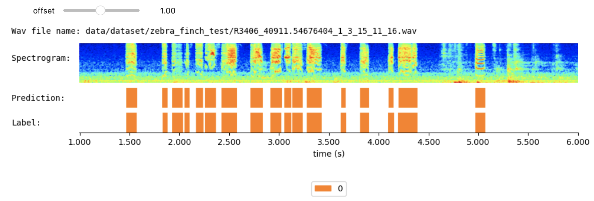
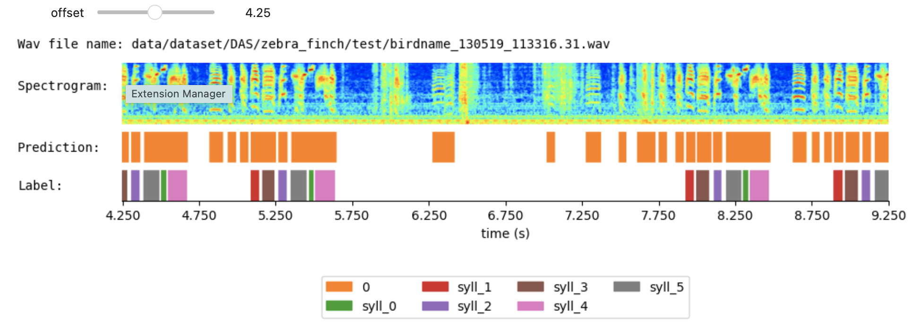
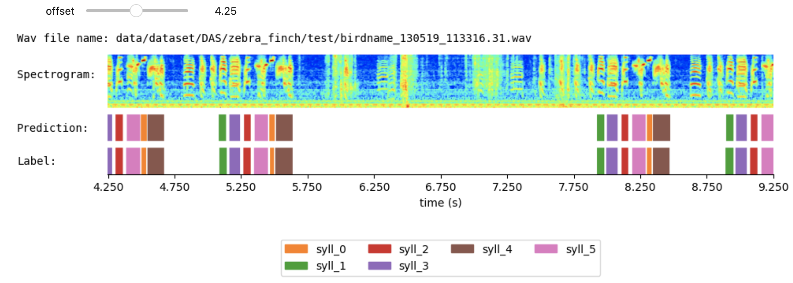
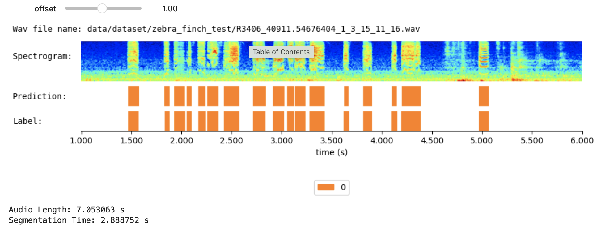

# Set up environment

## Option 1: Set up environment in your local computer
1. Install Miniconda (or Anaconda)
https://docs.conda.io/en/latest/miniconda.html

2. In the "base" anaconda environment, create a new environment "syllable_segment" (This installation will take a few minutes.):
```bash
conda env create -f environment.yml
```
3. Activate the anaconda environment "syllable_segment":
```bash
conda activate syllable_segment
```
Alternatively, one can go through all the packages that are imported, and install the missing packages manually.

## Option 2: Run the code on google colab (with GPU runtime)
Since google colab has preinstalled most of the package, we only need to install the "transformers" package
```bash
pip install transformers
```

The following commands assume that this jupyter notebook is running within the created anaconda environment, or with all necessary python packages installed.

# Use the pretrained WhisperSeg in command line


```python
from model import WhisperSegmenter
import librosa
import pandas as pd
import numpy as np
from tqdm import tqdm
import os
```


```python
segmenter = WhisperSegmenter( model_path = "nccratliri/whisperseg-zebra-finch", 
                        device = "cuda")
```


```python
# load an audio file, and resample the audio to the sampling rate 16000 Hz 
audio_file_name = "data/dataset/zebra_finch_test/R3406_40911.54676404_1_3_15_11_16.wav"
audio, _ = librosa.load( audio_file_name, sr = 16000 )
```


```python
# segment the audio, i.e., predict the paired on/offset of the audio
prediction = segmenter.segment( audio )
```


```python
print(prediction)
```

    {'onset': [1.47, 1.83, 1.9300000000000002, 2.055, 2.17, 2.26, 2.425, 2.715, 2.915, 3.055, 3.135, 3.2800000000000002, 3.625, 3.815, 4.1, 4.2, 4.97], 'offset': [1.58, 1.885, 2.035, 2.105, 2.24, 2.37, 2.58, 2.84, 3.03, 3.125, 3.24, 3.43, 3.67, 3.9050000000000002, 4.15, 4.39, 5.07], 'cluster': ['0', '0', '0', '0', '0', '0', '0', '0', '0', '0', '0', '0', '0', '0', '0', '0', '0']}


The key "cluster" refers to the type or name of each segments. This key-value pair can be ignored if we only needs to onset and offset.

To save the prediction into a .csv file, run the following command:


```python
pd.DataFrame(prediction).to_csv("predicted_annotations.csv", index = False)
```

# Visualize the prediction
This visualize function is only supported on jupter notebook and google colab, because it is an interactive plot that is a ipywidget feature.


```python
segmenter.visualize(audio = audio, prediction = prediction )
```


    interactive(children=(FloatSlider(value=1.0, description='offset', max=2.0530625000000002, step=0.25), Output(…


    <function ipywidgets.widgets.interaction._InteractFactory.__call__.<locals>.<lambda>(*args, **kwargs)>



If we know the ground-truth label, we can also plot both the predicted label and the ground-truth label to visualize the prediction error.

For example, we have the annotation file for the following wav file:


```python
human_annotation_file_name = "data/dataset/zebra_finch_test/R3406_40911.54676404_1_3_15_11_16.csv"
```


```python
""" 
Both label and prediction is a dictionary. 
The dictionary contains two keys: onset and offset. 
The value for each key is an numpy array
"""
label_df = pd.read_csv( human_annotation_file_name )
label = {
    "onset":np.array(label_df["onset"]),
    "offset":np.array(label_df["offset"]),
    "cluster":list(label_df["cluster"]) 
}
```


```python
segmenter.visualize( audio = audio, prediction = prediction, label = label, audio_file_name = audio_file_name)

```


    interactive(children=(FloatSlider(value=1.0, description='offset', max=2.0530625000000002, step=0.25), Output(…


    <function ipywidgets.widgets.interaction._InteractFactory.__call__.<locals>.<lambda>(*args, **kwargs)>



# Finetune WhisperSeg

We are going to finetune WhisperSeg on the zebra finch dataset released by the DAS paper. Let's have a look:


```python
audio_file_name = "data/dataset/DAS/zebra_finch/test/birdname_130519_113316.31.wav"
audio, _ = librosa.load( audio_file_name, sr = 16000 )

human_annotation_file_name = "data/dataset/DAS/zebra_finch/test/birdname_130519_113316.31.csv"
label_df = pd.read_csv( human_annotation_file_name )
label = {
    "onset":np.array(label_df["onset"]),
    "offset":np.array(label_df["offset"]),
    "cluster":list(label_df["cluster"]) 
}

prediction = segmenter.segment( audio )
```


```python
segmenter.visualize( audio = audio, prediction = prediction, label = label, audio_file_name = audio_file_name)

```


    interactive(children=(FloatSlider(value=4.25, description='offset', max=8.6498125, step=0.25), Output()), _dom…


    <function ipywidgets.widgets.interaction._InteractFactory.__call__.<locals>.<lambda>(*args, **kwargs)>



So the pretrained model cannot be directly applied to the DAS zebra finch dataset. Therefore we need to finetune it further.

## Dataset preparation
**Before finetuning WhisperSeg, we need to first prepare the training dataset and the test dataset.**

Take the training dataset as an example: 
* All training audio and annotation files should be placed in the same folder.
* The audio file should have a format ".wav" (lowercase),  and the annotation has a format ".csv"
* The names of the audio file and the corresponding annotation file should be matched. For example, if there is an audio file named "XXXXX_bird_12345.wav", the corresponding annotation file needs to be named as "XXXXX_bird_12345.csv"
* Inside the annotation file, there will be **three** columns: "**onset**", "**offset**" and "**cluster**". The unit of the value is second. The **cluster** denotes the name (or type) of each segment. If no cluster is needed, you can set the cluster value of each segment to a fixed string, e.g. "0" or "seg", etc.
* The .wav file can have various sampling rate. The model will resample them to 16kHz automatically.

For the testing dataset, the requirement is the same.

Please check the folder: data/DAS_zebra_finch/ for concrete examples.

## Training

Note: Before runing the following command, it is recommended to restart this jupyter notebook by Kernel -> Restart Kernel. This will release the GPU memory used in the previous cells.

Explanation of the training parameters:
* initial_model_path: The initail checkpoint of Wshiper, here we use the whisper model pretrained on Tomas's dataset
* model_folder: the folder to save the trained checkpoint
* result_folder: the folder to save some loging information and validation and test results
* train_dataset_folder: the folder that contains all the paired training audio and annotation data as described above
* test_dataset_folder: 
* timestamp_precision: the finest timestamp that can be predicted by the model, the default value is 5ms, which means the model can predicted onset or offset at 0.005, 0.010, ..., but not 0.0051. Set this value to a smaller value (e.g., 0.001) if your segments or gaps between segments can be very short, e.g., a few miliseconds.
* warmup_steps: the learning rate will increase from 0 linearly to 1e-6 within warmup steps
* save_every: save the checkpoint after save_every training steps
* max_num_iterations: the maximum number of training steps before the training finishes.
* batch_size: Training WhisperSeg requires around 40 GB GPU RAM if we use a batch size of 4. For smaller GPU, please try batch size 2 or 1.

Since the DAS_zebra_finch is a very small dataset, we finetune WhisperSeg for 1000 steps, and set up the warmup step to 100. 
We do not create validation set, and use all the training set to train the model until the max_num_iterations is reached, and we only keep the model checkpont at the max_num_iterations. Empirically this works very stable.


```python
!python train.py -initial_model_path nccratliri/whisperseg-zebra-finch  -model_folder  model/DAS/zebra_finch/whisperseg -result_folder  result/DAS/zebra_finch/whisperseg -train_dataset_folder  data/dataset/DAS/zebra_finch/train/ -test_dataset_folder  data/dataset/DAS/zebra_finch/test/ -timestamp_precision 0.005 -warmup_steps 100 -save_every 1000 -max_num_iterations 1000
```

    /home/meilong/miniconda3/envs/syllable_segment/lib/python3.9/site-packages/transformers/optimization.py:306: FutureWarning: This implementation of AdamW is deprecated and will be removed in a future version. Use the PyTorch implementation torch.optim.AdamW instead, or set `no_deprecation_warning=True` to disable this warning
      warnings.warn(
      0%|                                                    | 0/22 [00:00<?, ?it/s]/home/meilong/miniconda3/envs/syllable_segment/lib/python3.9/site-packages/torch/optim/lr_scheduler.py:138: UserWarning: Detected call of `lr_scheduler.step()` before `optimizer.step()`. In PyTorch 1.1.0 and later, you should call them in the opposite order: `optimizer.step()` before `lr_scheduler.step()`.  Failure to do this will result in PyTorch skipping the first value of the learning rate schedule. See more details at https://pytorch.org/docs/stable/optim.html#how-to-adjust-learning-rate
      warnings.warn("Detected call of `lr_scheduler.step()` before `optimizer.step()`. "
    100%|███████████████████████████████████████████| 22/22 [00:12<00:00,  1.81it/s]
    100%|███████████████████████████████████████████| 22/22 [00:09<00:00,  2.21it/s]
    100%|███████████████████████████████████████████| 22/22 [00:09<00:00,  2.20it/s]
    100%|███████████████████████████████████████████| 22/22 [00:10<00:00,  2.20it/s]
     50%|█████████████████████▌                     | 11/22 [00:05<00:04,  2.27it/s]Epoch: 4, current_batch: 100, learning rate: 0.000010, Loss: 4.0434
    100%|███████████████████████████████████████████| 22/22 [00:09<00:00,  2.20it/s]
    100%|███████████████████████████████████████████| 22/22 [00:11<00:00,  1.88it/s]
    100%|███████████████████████████████████████████| 22/22 [00:09<00:00,  2.20it/s]
    100%|███████████████████████████████████████████| 22/22 [00:10<00:00,  2.20it/s]
    100%|███████████████████████████████████████████| 22/22 [00:10<00:00,  2.20it/s]
      5%|██                                          | 1/22 [00:00<00:15,  1.36it/s]Epoch: 9, current_batch: 200, learning rate: 0.000009, Loss: 0.3950
    100%|███████████████████████████████████████████| 22/22 [00:09<00:00,  2.21it/s]
    100%|███████████████████████████████████████████| 22/22 [00:09<00:00,  2.23it/s]
    100%|███████████████████████████████████████████| 22/22 [00:11<00:00,  1.85it/s]
    100%|███████████████████████████████████████████| 22/22 [00:10<00:00,  2.15it/s]
     59%|█████████████████████████▍                 | 13/22 [00:06<00:04,  2.25it/s]Epoch: 13, current_batch: 300, learning rate: 0.000008, Loss: 0.3213
    100%|███████████████████████████████████████████| 22/22 [00:10<00:00,  2.18it/s]
    100%|███████████████████████████████████████████| 22/22 [00:10<00:00,  2.16it/s]
    100%|███████████████████████████████████████████| 22/22 [00:10<00:00,  2.20it/s]
    100%|███████████████████████████████████████████| 22/22 [00:11<00:00,  1.98it/s]
    100%|███████████████████████████████████████████| 22/22 [00:10<00:00,  2.05it/s]
     14%|██████                                      | 3/22 [00:01<00:09,  1.98it/s]Epoch: 18, current_batch: 400, learning rate: 0.000007, Loss: 0.2725
    100%|███████████████████████████████████████████| 22/22 [00:09<00:00,  2.22it/s]
    100%|███████████████████████████████████████████| 22/22 [00:09<00:00,  2.21it/s]
    100%|███████████████████████████████████████████| 22/22 [00:09<00:00,  2.20it/s]
    100%|███████████████████████████████████████████| 22/22 [00:09<00:00,  2.21it/s]
     68%|█████████████████████████████▎             | 15/22 [00:07<00:03,  1.96it/s]Epoch: 22, current_batch: 500, learning rate: 0.000006, Loss: 0.2267
    100%|███████████████████████████████████████████| 22/22 [00:11<00:00,  1.89it/s]
    100%|███████████████████████████████████████████| 22/22 [00:10<00:00,  2.19it/s]
    100%|███████████████████████████████████████████| 22/22 [00:09<00:00,  2.21it/s]
    100%|███████████████████████████████████████████| 22/22 [00:10<00:00,  2.18it/s]
    100%|███████████████████████████████████████████| 22/22 [00:10<00:00,  2.20it/s]
     23%|██████████                                  | 5/22 [00:02<00:07,  2.14it/s]Epoch: 27, current_batch: 600, learning rate: 0.000004, Loss: 0.1883
    100%|███████████████████████████████████████████| 22/22 [00:09<00:00,  2.21it/s]
    100%|███████████████████████████████████████████| 22/22 [00:11<00:00,  1.88it/s]
    100%|███████████████████████████████████████████| 22/22 [00:09<00:00,  2.20it/s]
    100%|███████████████████████████████████████████| 22/22 [00:09<00:00,  2.20it/s]
     77%|█████████████████████████████████▏         | 17/22 [00:07<00:02,  2.30it/s]Epoch: 31, current_batch: 700, learning rate: 0.000003, Loss: 0.1788
    100%|███████████████████████████████████████████| 22/22 [00:10<00:00,  2.19it/s]
    100%|███████████████████████████████████████████| 22/22 [00:10<00:00,  2.17it/s]
    100%|███████████████████████████████████████████| 22/22 [00:10<00:00,  2.19it/s]
    100%|███████████████████████████████████████████| 22/22 [00:11<00:00,  1.86it/s]
    100%|███████████████████████████████████████████| 22/22 [00:09<00:00,  2.23it/s]
     32%|██████████████                              | 7/22 [00:03<00:06,  2.18it/s]Epoch: 36, current_batch: 800, learning rate: 0.000002, Loss: 0.1571
    100%|███████████████████████████████████████████| 22/22 [00:10<00:00,  2.19it/s]
    100%|███████████████████████████████████████████| 22/22 [00:09<00:00,  2.21it/s]
    100%|███████████████████████████████████████████| 22/22 [00:10<00:00,  2.19it/s]
    100%|███████████████████████████████████████████| 22/22 [00:10<00:00,  2.20it/s]
     86%|█████████████████████████████████████▏     | 19/22 [00:10<00:01,  2.18it/s]Epoch: 40, current_batch: 900, learning rate: 0.000001, Loss: 0.1467
    100%|███████████████████████████████████████████| 22/22 [00:11<00:00,  1.85it/s]
    100%|███████████████████████████████████████████| 22/22 [00:10<00:00,  2.17it/s]
    100%|███████████████████████████████████████████| 22/22 [00:10<00:00,  2.16it/s]
    100%|███████████████████████████████████████████| 22/22 [00:09<00:00,  2.20it/s]
    100%|███████████████████████████████████████████| 22/22 [00:10<00:00,  2.20it/s]
     41%|██████████████████                          | 9/22 [00:04<00:05,  2.27it/s]Epoch: 45, current_batch: 1000, learning rate: 0.000000, Loss: 0.1272
     41%|██████████████████                          | 9/22 [00:12<00:18,  1.40s/it]
    The best checkpoint on validation set is: model/DAS/zebra_finch/whisperseg/checkpoint-1000,
    Reporting test results ...
    100%|█████████████████████████████████████████████| 2/2 [00:11<00:00,  5.89s/it]
    Test performance: f1 score: 1.0000
    Removing sub-optimal checkpoints ...
    All Done!


Let's use the finetuned WhisperSeg to segment the audio from the DAS_zebra_finch test set again.


```python
from model import WhisperSegmenter
import librosa
import pandas as pd
import numpy as np
from tqdm import tqdm
import os
```


```python
segmenter = WhisperSegmenter( model_path = "model/DAS/zebra_finch/whisperseg/checkpoint-1000", 
                        device = "cuda")
```


```python
audio_file_name = "data/dataset/DAS/zebra_finch/test/birdname_130519_113316.31.wav"
audio, _ = librosa.load( audio_file_name, sr = 16000 )

human_annotation_file_name = "data/dataset/DAS/zebra_finch/test/birdname_130519_113316.31.csv"
label_df = pd.read_csv( human_annotation_file_name )
label = {
    "onset":np.array(label_df["onset"]),
    "offset":np.array(label_df["offset"]),
    "cluster":list(label_df["cluster"]) 
}
prediction = segmenter.segment( audio )

```


```python
segmenter.visualize( audio = audio, prediction = prediction, label = label, audio_file_name = audio_file_name)
```


    interactive(children=(FloatSlider(value=4.25, description='offset', max=8.6498125, step=0.25), Output()), _dom…


    <function ipywidgets.widgets.interaction._InteractFactory.__call__.<locals>.<lambda>(*args, **kwargs)>



Therefore, WhisperSeg does perform better after finetuning!

# Speed Up Inference with ctranslate2 - WhisperSegmenterFast

The environment.yml has been updated due to the adding of the ctranslate2 package. 

**Running the code below does not rely on the previous codes in this notebook. One can restart the kernel before run the following code, to release some GPU usage.**

## convert the huggingface Whisper model to the CTranslate2 model, and store the configuration files of the tokenizer and feature-extractor

**Note: The following cell only needs to be run once. Once the model is converted, one can directly use the ctranslate converted model as shown below.**


```python
from huggingface_hub import hf_hub_download
from transformers import WhisperForConditionalGeneration, WhisperFeatureExtractor, WhisperTokenizer
import os
import shutil
## If you have trained model on new dataset, replace this hf_model_path's value with the path to the newly saved checkpoint
hf_model_path = "nccratliri/whisperseg-zebra-finch"
## The path to the folder where the converted ctranslate2 model will be saved. 
## In the meantime, the configuration files for Tokenizer and FeatureExtractors will also be copied to this folder
ct2_model_path = "model/whisperseg-zebra-finch-ct2"

assert not os.path.exists(ct2_model_path)

os.system( "ct2-transformers-converter --model %s --output_dir %s"%( hf_model_path, ct2_model_path ) )
## copy the configuration file of the original huggingface model, because it contains some useful hyperparameters
if os.path.exists(hf_model_path):
    if not os.path.exists(ct2_model_path+"/hf_model/"):
        os.makedirs(ct2_model_path+"/hf_model/")
    shutil.copy( hf_model_path + "/config.json", ct2_model_path+"/hf_model/" )
else:
    hf_hub_download(repo_id=hf_model_path, filename="config.json", local_dir = ct2_model_path+"/hf_model/")

WhisperFeatureExtractor.from_pretrained( hf_model_path ).save_pretrained( ct2_model_path+"/hf_model/" )
WhisperTokenizer.from_pretrained(hf_model_path, language = "english" ).save_pretrained( ct2_model_path+"/hf_model/" )
```


    ('model/whisperseg-zebra-finch-ct2/hf_model/tokenizer_config.json',
     'model/whisperseg-zebra-finch-ct2/hf_model/special_tokens_map.json',
     'model/whisperseg-zebra-finch-ct2/hf_model/vocab.json',
     'model/whisperseg-zebra-finch-ct2/hf_model/merges.txt',
     'model/whisperseg-zebra-finch-ct2/hf_model/normalizer.json',
     'model/whisperseg-zebra-finch-ct2/hf_model/added_tokens.json')


## Use the CTranslate2 Converted Model


```python
from model import WhisperSegmenterFast
import librosa
import pandas as pd
import numpy as np
from tqdm import tqdm
import os
import time
```


```python
segmenter_fast = WhisperSegmenterFast( "model/whisperseg-zebra-finch-ct2", device="cuda" )


```


```python
audio_file_name = "data/dataset/zebra_finch_test/R3406_40911.54676404_1_3_15_11_16.wav"
human_annotation_file_name = "data/dataset/zebra_finch_test/R3406_40911.54676404_1_3_15_11_16.csv"
audio, _ = librosa.load( audio_file_name, sr = 16000 )
label_df = pd.read_csv( human_annotation_file_name )
label = {
    "onset":np.array(label_df["onset"]),
    "offset":np.array(label_df["offset"]),
    "cluster":label_df["cluster"]
}

tic = time.time()
prediction = segmenter_fast.segment( audio, batch_size=16 )
tac = time.time()

segmenter_fast.visualize( audio = audio, prediction = prediction, label = label, audio_file_name = audio_file_name)

print("Audio Length: %f s"%(len(audio)/16000))
print("Segmentation Time: %f s"%(tac - tic))
```


    interactive(children=(FloatSlider(value=1.0, description='offset', max=2.0530625000000002, step=0.25), Output(…


    Audio Length: 7.053063 s
    Segmentation Time: 2.888752 s



# Run WhisperSeg as a Web Service

Runing WhisperSeg as a Web service make it possible to disentangle the environment of the WhisperSeg and the environment where this segmenting function is called. For example, we can set up a WhisperSeg segmenting service at one machine, and call the segmenting service in different working environment (Matlab, Webpage frontend, Jupyter Notebook) at different physical locations.

This enables an easy implementation of calling WhisperSeg in Matlab and is essential for setting up a Web page for automatic vocal segmentation.

## Step 1: Starting the segmenting service
In a terminal, run the following command:
```bash
python segment_service.py -flask_port 8050 -model_path model/whisperseg-zebra-finch-ct2 -device cuda
```

Illustration of the parameters:
* flask_port: the port that this service will keep listening to. Requests that are sent to this port will be handled by this service
* model_path: the path to the WhisperSeg model. This model can either be original huggingface model, e.g., nccratliri/whisperseg-zebra-finch, or CTranslate converted model, e.g., model/whisperseg-zebra-finch-ct2. If you choose to use the Ctranslate converted model, please make sure the converted model exists.
* device: where to run the WhisperSeg. It can be cuda or cpu. By default we run the model on cuda

**Note**:
The terminal that runs this service needs to be kept open. On Linux system's terminal, one can first create a new screen and run the service in the created screen, to allow the service runing in the background.

## Step 2: Calling the segmenting service

### call the segmenting service in python:


```python
import requests,json,base64

## define a function for segmentation
def call_segment_service( audio_file_path, service_address ):
    audio_file_base64_string = base64.b64encode( open(audio_file_path, 'rb').read()).decode('ASCII')
    response = requests.post( service_address,
                              data = json.dumps( {
                                  "audio_file_base64_string":audio_file_base64_string
                              } ),
                              headers = {"Content-Type": "application/json"}
                            )
    return response.json()
```


```python
prediction = call_segment_service( audio_file_path = "data/dataset/zebra_finch_test/R3406_40911.54676404_1_3_15_11_16.wav", 
                                   service_address = "http://localhost:8050/segment")

print(prediction)
```

    {'cluster': ['0', '0', '0', '0', '0', '0', '0', '0', '0', '0', '0', '0', '0', '0', '0', '0', '0'], 'offset': [1.58, 1.885, 2.035, 2.105, 2.24, 2.37, 2.58, 2.8449999999999998, 3.03, 3.125, 3.24, 3.43, 3.67, 3.9050000000000002, 4.15, 4.39, 5.07], 'onset': [1.47, 1.83, 1.9300000000000002, 2.055, 2.17, 2.26, 2.425, 2.715, 2.915, 3.055, 3.135, 3.2800000000000002, 3.625, 3.815, 4.1, 4.2, 4.97]}


**Note:** 
1. Runing the following code does not require any further dependencies or load any models
2. The service_address is composed of **SEGMENTING_SERVER_IP_ADDRESS** + **":"** + **FLASK_PORT_NUMBER** + **"/segment"**. If the server is running in the local machine, then the SEGMENTING_SERVER_IP_ADDRESS is "http://localhost", otherwise, you will need to know the IP address of the server machine. 

### call the segmenting service in MATLAB:

First define a matlab function

```matlab

function response = call_segment_service(audio_file_path, service_address)

    fileID = fopen(audio_file_path, 'r');
    fileData = fread(fileID, inf, 'uint8=>uint8');

    audio_file_base64_string = matlab.net.base64encode( fileData );
    data = struct('audio_file_base64_string', audio_file_base64_string);
    jsonData = jsonencode(data);

    options = weboptions( 'RequestMethod', 'POST', 'MediaType', 'application/json'  );
    response = webwrite(service_address, jsonData, options);

end
```

Then call the matlab function in MATLAB console:

```matlab
prediction = call_segment_service( 
                           'data/dataset/zebra_finch_test/R3406_40911.54676404_1_3_15_11_16.wav', 
                           'http://localhost:8050/segment' 
                      )
disp(prediction)

```


```python

```


## References

https://opennmt.net/CTranslate2/python/ctranslate2.models.Whisper.html?highlight=max_length
https://opennmt.net/CTranslate2/guides/transformers.html#whisper
