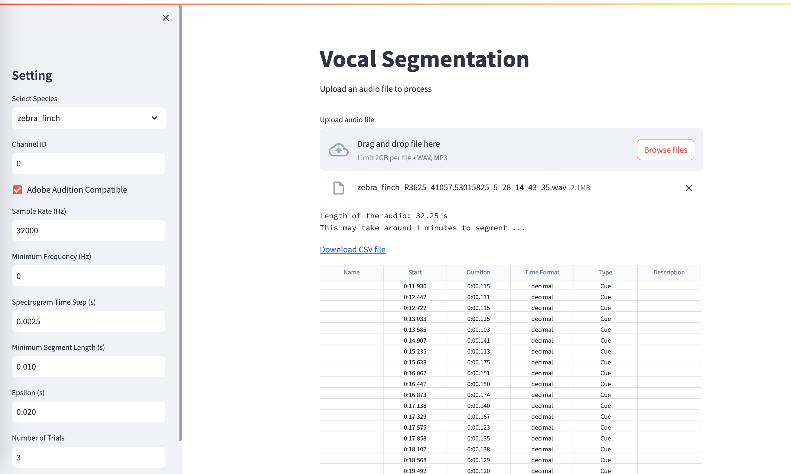

# Run WhisperSeg via GUI

## Step 1: Starting the segmenting GUI
In a terminal, go to the main folder of this repository, first activate the anaconda environment:
```bash
conda activate wseg
```

and run the following command:
```bash
streamlit run demo.py --server.maxUploadSize 2000 --server.port 8080 --  --model_path nccratliri/whisperseg-large-ms-ct2 --device cuda
```
**Illustration of parameters:**
1. **server.maxUploadSize**: The maximum size (in MB) of the uploaded audio file.
2. **server.port**: The port of the server. If it is 8080, then user can open http://localhost:8080 in the browser and enter the GUI.
3. **model_path**: The checkpoint path of the WhisperSeg model that is used for segmentation. Here we use "nccratliri/whisperseg-large-ms-ct2" as an example.
4. **device**: cuda or cpu

## Step 2: Use the GUI
In the left panel, once can modify the segmentation parameters. The details of these parameters are covered in [README.md#Illustration-of-segmentation-parameters](../README.md#Illustration-of-segmentation-parameters), and recommended parameters setting for some common species are available in the config file: [config/segment_config.json](../config/segment_config.json)

